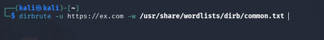
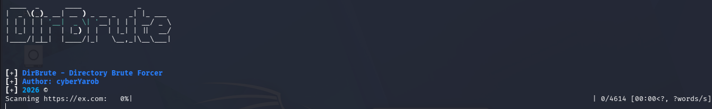

# 🛡 DirBrute 
Fast and Simple Directory Brute-forcing Tool for Web Pentesting


---

## 📖 Description
DirBrute is a powerful yet simple tool designed to discover hidden directories and files on web servers. It helps security researchers and bug bounty hunters find sensitive paths that are not linked anywhere on the website.                                                       

---

## 🚀 Installation & Usage

Follow these steps to get the tool running on your machine:

### 1️⃣ Clone the repository
```bash
git clone https://github.com/Cyb3rY4r0b/DirBrute.git
cd DirBrute
```                                                                                                                                        
### 2️⃣ Prepare the environment                                                                                                                 
Make the scripts executable and run the preparation script to install dependencies:                                                        
```bash
chmod +x dirbrute prepare.sh
./prepare.sh
```
### 3️⃣ Run the tool                                                                                                                            
```bash
dirbrute
```
---                                                                                                                                        

## Screens                                                                                                                                 
                                                                                                            
                                                                                                            
                                                                                                                                           
---                                                                                                                                        
                                                                                                                                           
## ✨ Features                                                                                                                             
[x] Fast directory scanning.                                                                                                               
[x] Easy to setup and use.                                                                                                                 
[x] Compatible with Linux (Parrot, Kali, Ubuntu).                                                                                          
[x] Supports custom wordlists.                                                                                                             
## 👤 Author                                                                                                                               
Developed by Yarob (Cyb3rY4r0b)                                                                                                            
Identity: Cybersecurity Enthusiast & Developer.                                                                                            
## ⚠️ Disclaimer                                                                                                                           
This tool is for educational purposes and ethical hacking only. Use it at your own risk. The developer is not responsible for any misuse.
